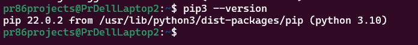
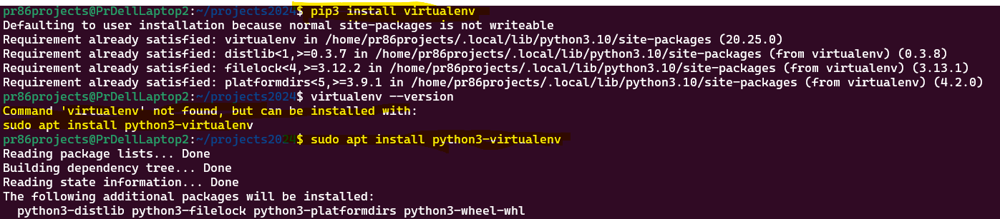
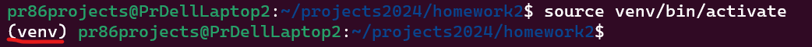

# Homework 2

## Install Python
- `$ sudo apt-get update`
- `$ sudo apt-get -y upgrade`

## Check version
- `$ python3 -V`

## Install package manager Pip
- `$ sudo apt-get install -y python3-pip`
- `$ pip3 --version` 

## Get help on a specific command
### e.g. install command
- `$ pip install --help `

## Install a Virtual environment library - Manager
- `$ pip3 install virtualenv`
This is global for your whole computer. This is a virtual environment manager. Using this you will setup a virtual environment for your project.
Check version
- `$ virtualenv --version`
        Command 'virtualenv' not found, but can be installed with:
        sudo apt install python3-virtualenv
- `$ sudo apt install python3-virtualenv`

## Create a new folder for this project
- `$ mkdir homework2`
- `$ cd homework2`
- `$ git init -> initialize git on this new folder`
    ### Create some files
        - `$ touch readme.md`
        - `$ touch .gitignore`
        - `$ mkdir calculator`
        - `$ mkdir tests`
        - `touch calculator/__init__.py`
        - `touch tests/__init__.py`
        - `touch .pylintrc`
        - `touch pytest.ini`
        - `touch tests/test_calculator.py`
        - `$ vi .gitignore`
            *.sw*
            .coverage
            .pytest_cache
            *pycache*
        - `$ git add -A --> add all files at once`
        - `$ git commit -m "add the required files created with touch command"`

## Create a Virtual Environmental for this project and activate
- `$ virtualenv -p /usr/bin/python3 venv`
- `$ source venv/bin/activate`

## We are now in the virtual environment. Let's install the libraries in this virtual environment.
    - `$ pip install pytest`
    - `$ pip install pylint-pytest`
    - `$ pip install pytest-pylint`
    - `$ pip install pytest-cov`
    - `$ touch requirements.txt`
    - `$ pip freeze > requirements.txt`
    - `$ vi requirements.txt`

## GitHub - Remote publish 
    - Create a new repository on GitHub is601-hw2
        `git@github.com:pr86-projects/is601-hw2.git`
    - git remote add origin git@github.com:pr86-projects/is601-hw2.git
    - git push -u origin main
    - Update your code as per the professor, commit and push changes

## Open this code in VSCode - $ code .
- `$ source venv/bin/activate`
- `$ pytest - Just run the tests`
- `$ pytest --pylint --cov - Run tests, with pylint and code coverage`
Add additional tests. Commit changes to GitHub
- `$ git add requirements.txt`
- `$ git commit -m "added code and few more tests and requirements.txt file"`

